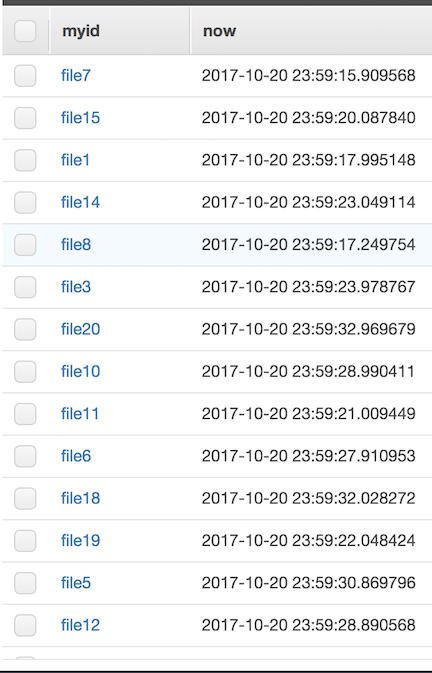

### Overview

This is a simple [Serverless Application Model](https://github.com/awslabs/serverless-application-model) application that demonstrates throttling Lambda invocations by leveraging an SNS Delivery policy. This could be useful where a large number of objects are uploaded to S3 which require Lambda to take some action on each one. If you subscribed a Lambda function directly to S3, you run the risk of having your Lambda function throttled (number of concurrent Lambda functions running at a time) or, depending on the upstream service from Lambda, overwhelming it. Instead, here's a simple way you can use SNS to throttle the amount of times Lambda is invoked:

* Notification events are configured on an S3 bucket. These are configured to send on any ObjectCreate:* API call.
* These messages are sent to an SNS topic. This topic has a SNS Delivery Policy (only applicable with HTTP / HTTPS endpoints subscribed) which limits the maximum number of receives per second. By default, I have this set to 1 per second.
* An API Gateway resource is created to receive these HTTPS requests from SNS and proxies them to the Lambda function.
* The Lambda function does 1 of 2 things:
  1. When the CloudFormation template is first deployed, the SNS Topic sends a subscription request. There is logic in the Lambda function to handle the request and confirm the subscription.
  1. Otherwise, the function takes the S3 key of the event, along with a timestamp, and inerts this into a DynamoDB table. This is used to demonstrate the frequency with which the function is being called.



### Getting Started

#### Update Configuration
Due to a limitation of SAM, you'll need to specify some values specific to your environment in the ```swagger.yaml``` file. Specifically, replace ```<<account>>``` and ```<<region>>``` with the AWS Account ID and region you wish to deploy to first.

You'll also want to specify a unique S3 bucket name. In ```template.yaml```, specify a unique value for the ```S3BucketName``` parameter.

#### Install Dependencies
To get this up and running, you'll need to install the python requirements. The simplest way to do this:

```
$ virtualenv venv3
$ source venv3/bin/activate
$ pip3 install -r requirements.txt
```

#### Package and Deploy

Once you have the dependencies installed, package the SAM application and deploy it using the AWS CLI.

First package it and create the resulting CloudFormation template:

```
$ aws cloudformation package \
    --template-file template.yaml \
    --s3-bucket bucket-name \
    --output-template-file package.yaml
```

Now deploy the stack in your account:

```
$ aws cloudformation deploy \
    --template-file package.yaml \
    --stack-name my-new-stack \
    --capabilities CAPABILITY_IAM
```

#### CloudFormation Custom Resource

Because you can not natively define an SNS Delivery Policy in CloudFormation (at least, not that I was able to fine), I created a custom resource using Lambda. All this Lambda function does is apply the Delivery Policy to the SNS Topic. 

Note the ```MaxPerSecond``` parameter in the CloudFormation template. Use this value to adjust how many messages per second the SNS topic delivers to the Lambda function.
